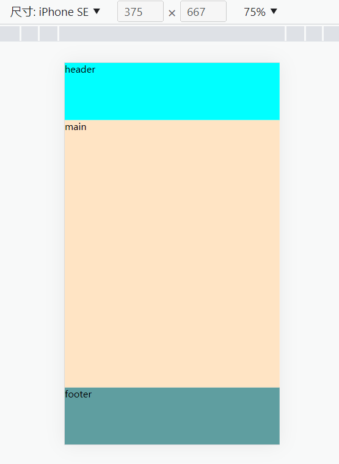
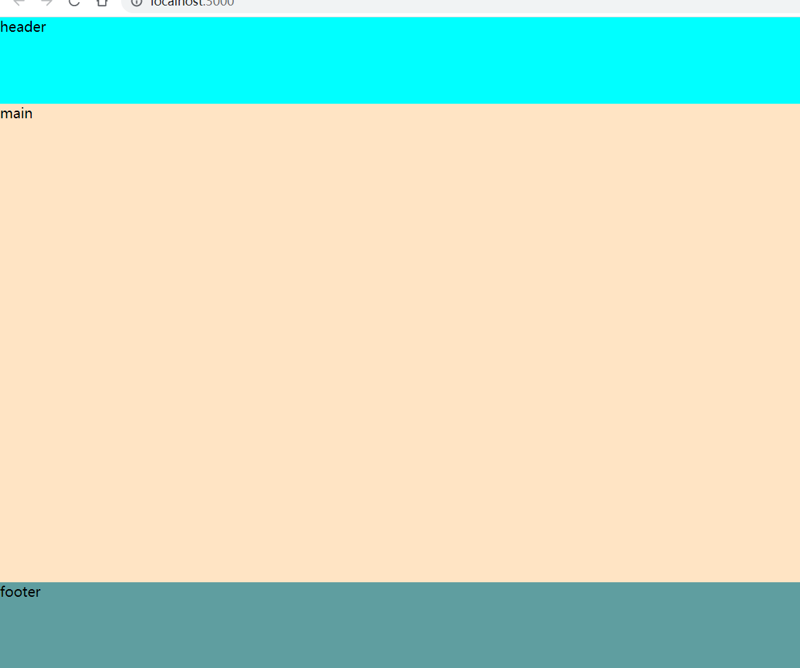
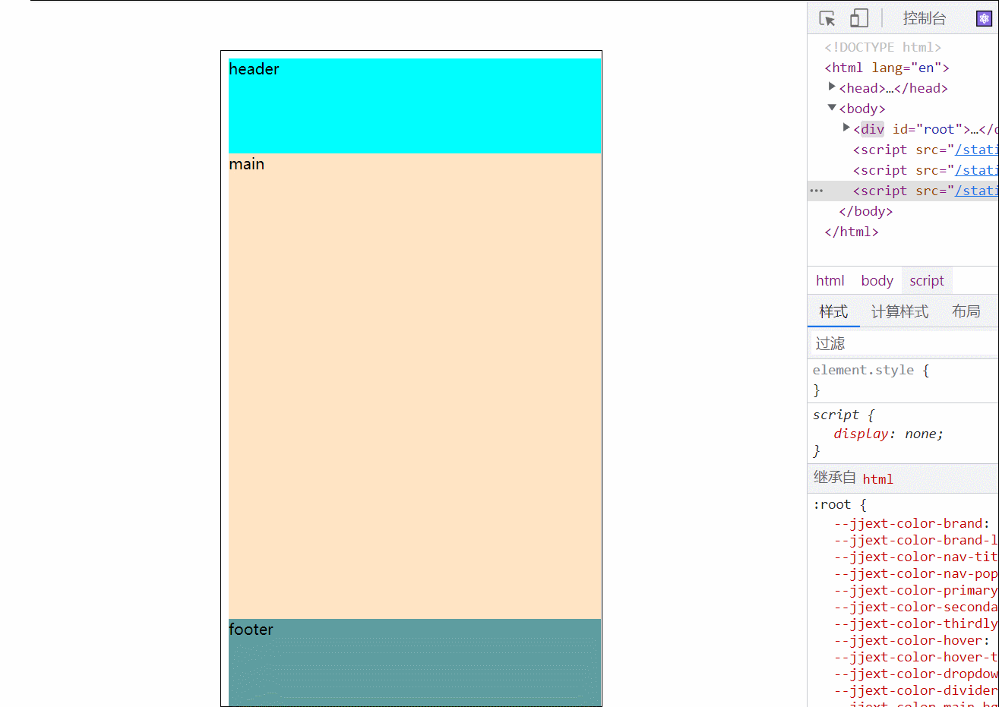

# 目的 & 需求

主要实现 移动端的组件在 PC 端的预览

也就是 让一个 写好了移动端样式 —— 用了 vw 什么的

在管理系统预览时有良好效果

# 问题

问题：移动端正常这样



桌面直接引入就会变成这样



# 使用

使用 Deepview 组件

```tsx
const App: React.FC = () => {
  return (
    <>
      <Preview MobileUI={UIinPhone} id='preview' />
    </>
  )
}
```

# 效果

## 1.0



## 2.0

1.0 缺陷，body 无法自定义清除样式，只能行内样式，相对路径引入报错

2.0 我尝试动态插入 link 标签引入 css 但还是失败了 —— 之后再看看

```js
let cssLink = document.createElement('link')
cssLink.href = cssLinkHref
cssLink.rel = 'stylesheet'
cssLink.type = 'text/css'

const iframeDom = window.frames[id].contentDocument

const headDom = iframeDom
  ?.getElementsByTagName('HEAD')
  .item(0)
headDom?.appendChild(cssLink)
```

# 遇到的问题

- 在 UI 组件直接引入 CSS 的话， iframe 标签中的样式就会失效 —— 现在只能选择行内样式

> 网上有说使用绝对路径引入 CSS 的，但我没有尝试

# 文件介绍

- App 入口不解释
- preview 是在 PC 端使用的
  - 参数接受 mobileUI 组件——要渲染的组件
  - 其余传参给到 mobileUI
